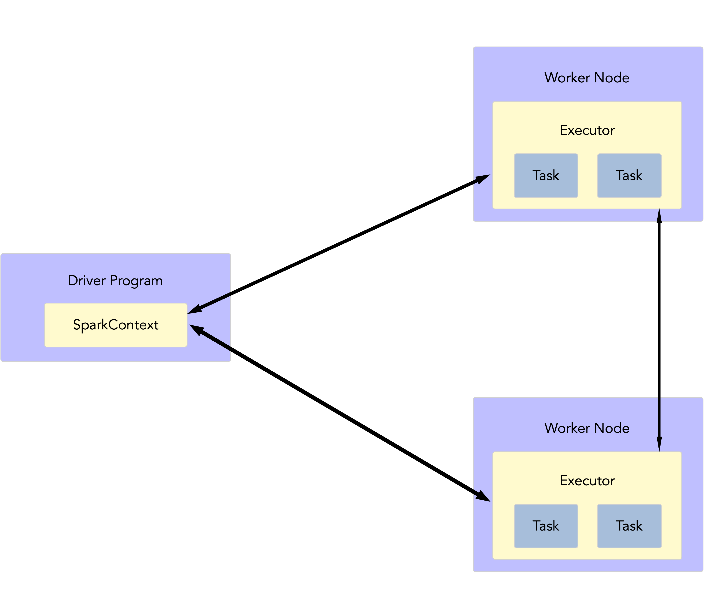
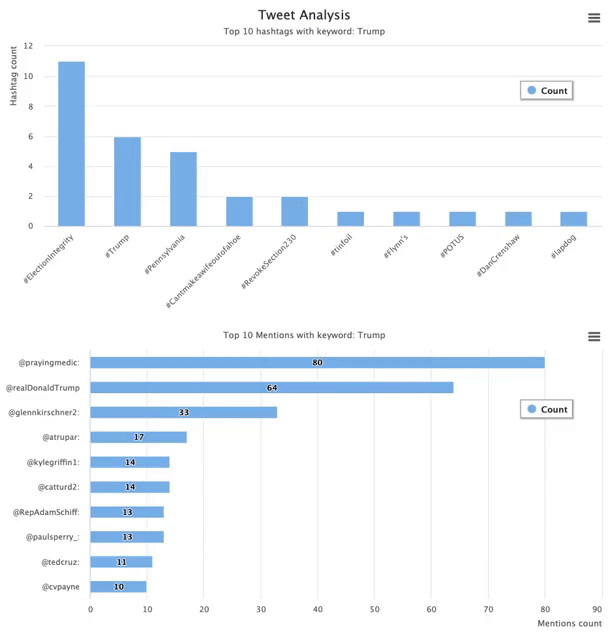

<!-- PROJECT LOGO -->

<p align="center">
   
  <h1 align="center">Twitter-Spark-Project</h1>
  <br />
  <p align="center">
    CSCI596 Final Project <br />
    Yihang Wang <br />
    Wei Cheng <br />
    Ruoxuan Wang <br />
</p>


<!-- TABLE OF CONTENTS -->

## Table of Contents

* [About the Project](#about-the-project)
  * [Built With](#built-with)
  * [How it works](#how-it-works)
  * [Architecture](#built-with)
  * [Why Spark](#why-spark)
* [Getting Started](#getting-started)
  * [Installation](#installation)
  * [How to run](#how-to-run)
* [Data Visualization](#data-visualization)
* [Acknowledgements](#acknowledgements)


<!-- ABOUT THE PROJECT -->

## About The Project

In this project, we built a real-time data pipeline using Spark Streaming and Kafka. The basic idea is fetching, analyzing and visualizing realtime twitter data to get the top 10 trending hashtags and top 10 mentions which contain specific keywords.


### Built With
* [Tweepy](https://www.tweepy.org/)
* [Apache Kafka](https://kafka.apache.org/)
* [Apache Spark](https://spark.apache.org/) 
* [Node.js](https://nodejs.org/en/)
* [Socket.io](https://socket.io/)
* [HighCharts](https://www.highcharts.com/)

### How it works

* Using Tweepy library to access realtime twitter streaming data through Twitter API, and then send the streams to Kafka.
* Kafka acts as the central hub for real-time streams of data, receives streaming data from twitter and persists the data for a specific time period.
* Spark is listening to Kafka topics, waiting for processing streams by high-level functions as map(), filter(), updateStateByKey() and countByValues().
* Processed stream data be pushed out to new Kafka topics.
* Front-end receives data from Kafka topics and visualizes the real-time data to interactive charts.


### Architecture
<p align="center">

</p>


### Why Spark

#### Basics

Spark, a fast and general-purpose engine for *large-scale data processing*, is wildly popular with data scientists because of its speed, scalability and ease-of-use.

At a high level, a Spark application consists two parts: a *driver program* that runs the user's `main` function and executes various *parallel operations* on a cluster. To better realize the concepts, the main abstraction Spark provides is called *resilient distributed dataset* (RDD).

<p align="center">

</p>

#### RDD and DStreams

Spark revolves around the concept of a *resilient distributed dataset* (RDD), which is a fault-tolerant collection of elements that can be operated on in parallel. In other words, RDD is a collection of objects that can be run and computed in parallel on several nodes in a cluster. 

**Data Sources**

- parallelized collections created by calling `sc.parallelize()`
- external datasets supported by Hadoop, including the local file system, HDFS, Cassandra, HBase, Amazon S3, etc.

**Transformations**

The first operation on RDDs is *transformations*, which create a new dataset from an existing one. Common transformations includes:

- map()
- filter()
- flatMap()
- groupByKey()
- reduceByKey()

For example, in our program, we have filter() to filter hashtags in tweets.

```
hashtags = words.filter(lambda hashtag: len(hashtag) > 2 and '#' == tag[0])
```

All transformations in Spark are *lazy*, which means they do not compute the results until an action requires a result to return.

**Actions**
The second operation on RDDs is *actions*, which return a value to the driver program after running a computation on the dataset.

Common actions includes:

* reduce()
* collect()
* count()
* foreach()

More Transformations and Actions refer to the link [RDD API doc - Python](https://spark.apache.org/docs/latest/api/python/pyspark.html#pyspark.RDD) 

**Integration with Kafka**

Here in our program, we use Kafka Topic as data source to create DStream.

```
tweets = KafkaUtils.createDirectStream(
        ssc, topic=topic, kafkaParams=kafkaParam, valueDecoder=lambda x: json.loads(x.decode('utf-8')))
```

Another Kafka Topic as sink of processed streaming data.

```
producer = KafkaProducer(bootstrap_servers=['localhost:9092'], value_serializer=lambda v: json.dumps(v).encode('utf-8')
producer.send(topic, value)
```


#### DataFrames, Datasets and Structured Streaming

RDDs contain Java objects, they suffer from both *Garbage Collection* and *Java serialization issues*, which are expensive operations when the data grows. Because of this, DataFrames were introduced in the library.

A DataFrame is a dataset organized into *named columns*. DataFrames can be constructed from different sources: structured data files, Hive tables, tables from external databases, or even existing RDDs.

Compared to RDDs, DataFrames offer a *higher level of abstraction*. In fact, DataFrames can be treated as tables. Spark SQL provides APIs to run SQL queries on DataFrames with a simple SQL-like syntax.

For example, by using DataFrames, we can easily filter hashtags by SQL-like code below: 

```
hashtags = words.filter(col("hashtag").startswith("#"))
```

More DataFrames and Dataset APIs refer to [Spark SQL, DataFrames and Datasets Guide](https://spark.apache.org/docs/latest/sql-ref-functions.html)

**Structured Streaming**

By the power of DataFrame and Dataset, Spark introduces [Structured Streaming](https://spark.apache.org/docs/latest/structured-streaming-programming-guide.html), where we can express streaming computation the same way as express a batch computation on static data. 

The basic concept of Structured Streaming is, a query on the input will generate the “Result Table”. Every trigger interval (say, every 1 second), new rows get appended to the Input Table, which eventually updates the Result Table. Whenever the result table gets updated, we would want to write the changed result rows to an external sink.

<p align="center">

</p>

**Integration with Kafka**

Also, it's simple and practical to create a Kafka source for streaming queries

```
df = spark \
  .readStream \
  .format("kafka") \
  .option("kafka.bootstrap.servers", bootstrap_server) \
  .option("subscribe", input_topic) \
  .load()
ds = df.selectExpr("CAST(key AS STRING)", "CAST(value AS STRING)")
```

And to create a Kafka sink for streaming output

```
ds = hashtagCounts\
	.selectExpr("CAST(key AS STRING)", "CAST(value AS STRING)") \
  .writeStream\
  .outputMode('complete')\
  .format("kafka")\
  .option("kafka.bootstrap.servers", bootstrap_server)\
  .option("topic", output_topic)\
  .trigger(processingTime='60 seconds')\
  .option("checkpointLocation", checkpointLocation)\
  .start()
```

**Output table**

Query Top 10 hashtags includes keyword 'vaccine'.

```
-------------------------------------------
Batch: 7
-------------------------------------------
+-------------------+-----+
|                key|value|
+-------------------+-----+
|           #COVID19|   30|
|    #NoVaccineForMe|   10|
|           #vaccine|    9|
|      #CovidVaccine|    9|
|     #covid19canada|    6|
|           #cdnpoli|    6|
|            #WakeUp|    6|
|#RecallGavinNewsom"|    6|
|            #Pfizer|    6|
|  #WhiteLivesMatter|    5|
+-------------------+-----+
```


#### Performance and Optimization: RDDs vs DataFrames and Datasets

Basically, RDD, DataFrame and Dataset are three APIs Spark provided. We can convert a RDD to a DataFrame, or convert a DataFrame to a RDD. However, RDD offers low-level functionality and control on a set of Java objects, while DataFrame and Dataset offer high-level domain-specific operations with structured data. In [High Performance Spark](http://shop.oreilly.com/product/0636920046967.do) Chapter 3. DataFrames, Datasets, and Spark SQL, we can see some performance comparation between Dataframe/Dataset and RDD.

Space Efficiency:
<p align="center">

</p>

Time Efficiency:
<p align="center">

</p>
To sum up, because DataFrame and Dataset APIs are built on top of the Spark SQL engine, it could save more space, and executes at a superior speed. 

<!-- GETTING STARTED -->

## Getting Started

This is an example of how you may give instructions on setting up your project locally.
To get a local copy up and running follow these simple example steps.

### Installation

This is an example of how to list things you need to use the software and how to install them.
* Get a free Tweeter developer account and apply for API Keys at [Twitter Developers](https://developer.twitter.com/en)
* [Setup Kafka environment](https://kafka.apache.org/quickstart)
* [Setup Spark environment](https://spark.apache.org/)
* Install Python packages
```sh
pip install -r <dependencies>
```
* Install Npm packages
```sh
npm install <dependencies>
```

### How to run

1. Enter your API keys in `app/auth_keys.py`
2. Start the Zookeeper Servive
```sh
bin/zookeeper-server-start.sh config/zookeeper.properties
```
3. Start the Kafka broker service
```sh
bin/kafka-server-start.sh config/server.properties
```
4. Create Kafka Topics to store your events
```sh
$ bin/kafka-topics.sh --create --topic <topic_name> --bootstrap-server localhost:9092
```
5. Run `fetch_tweets.py` to fetch data from twitter API
```sh
python fetch_tweets.py 
```
6. Run `analyze_tweets.py` to analyze data by Spark
```sh
python analyze_tweets.py 
```
7. Start npm server
```sh
node dashboard.js
```


<!-- RESULTS -->
## Data Visualization



<!-- ACKNOWLEDGEMENTS -->

## Acknowledgements
* [Tweepy Documentation](http://docs.tweepy.org/en/latest/index.html)
* [kafka-python](https://kafka-python.readthedocs.io/en/master/index.html#)
* [Spark Streaming + Kafka Integration Guide](https://spark.apache.org/docs/latest/streaming-kafka-0-10-integration.html)
* [Spark by {Examples}](https://sparkbyexamples.com/)
* [kafka-node](https://www.npmjs.com/package/kafka-node)

